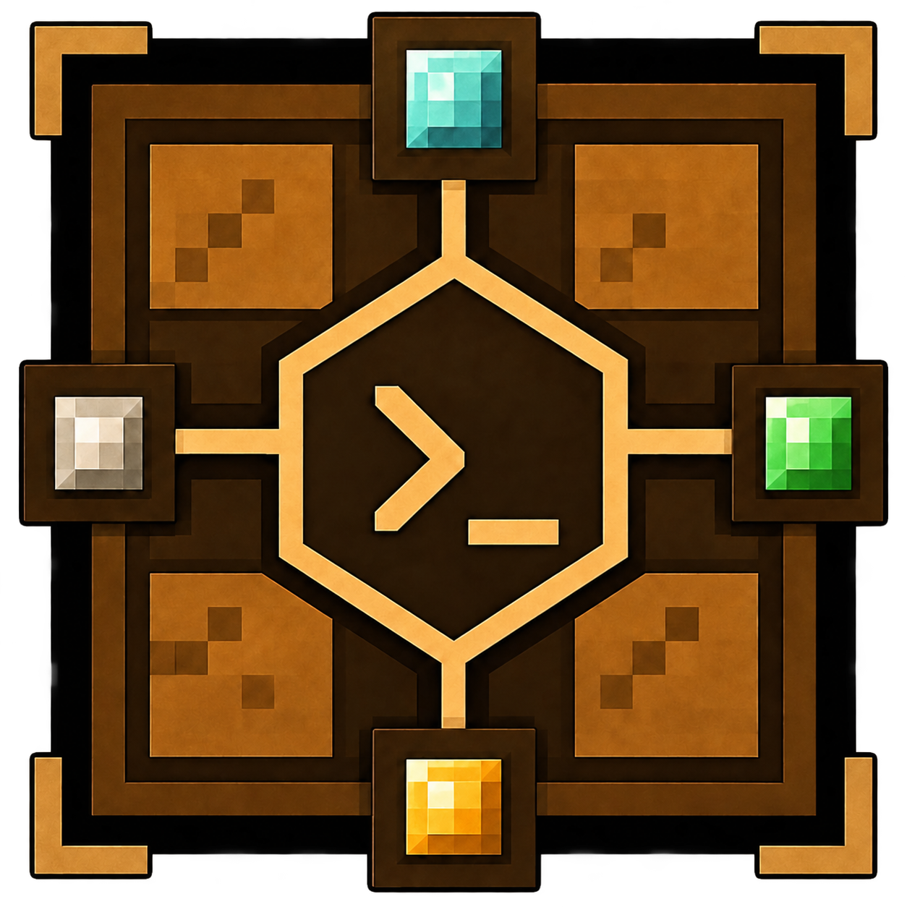
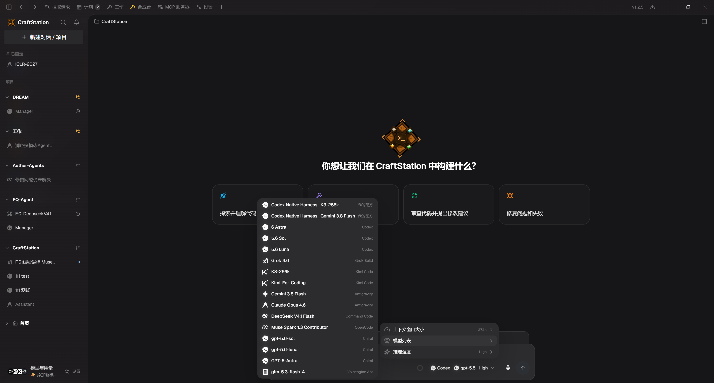
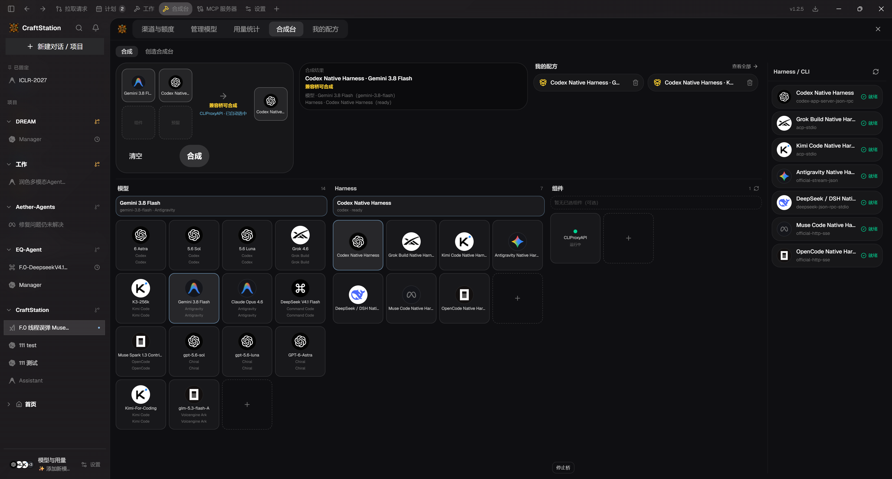
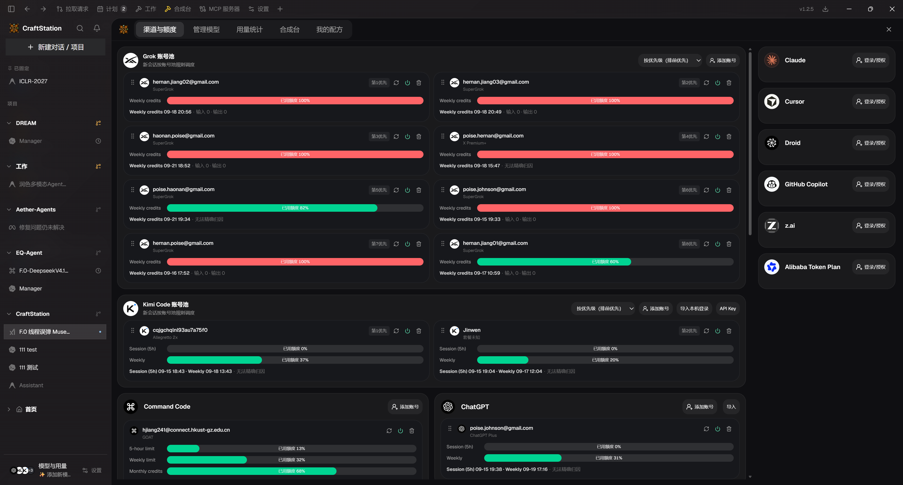

  

<h1 align="center">CraftStation</h1>

  <strong>Agent Runtime Composition System</strong> 
  Compose a Model × Harness into a running Session. 
  Not a multi-model chat GUI, not a CLI launcher, not a reskin of any single harness.

  <a href="./README.zh-CN.md">中文</a>
  ·
  <a href="https://github.com/HernanJiang/CraftStation/releases">Download</a>
  ·
  <a href="./LICENSE">Apache 2.0</a>

<em>HernanJIANG</em>

---

CraftStation treats an agent run as a **craft**: pick Items (model, harness, tools, accounts), form a Recipe, let the Crafter compile a plan, spawn an Entity, and keep working inside a Session.

**Auto** chooses the native Harness for that model family so the model keeps its full runtime.  
A Recipe you save on the workbench is an explicit composition: launch should be _that_ Harness + _that_ model.

  

<em>One window for Codex, Kimi Code, Antigravity, OpenCode, Command Code, and more. Saved recipes sit at the top of the model list.</em>

## Capabilities

### Many CLIs and harnesses, one scheduler

Codex, OpenCode, Kimi Code, Antigravity / Gemini, Grok, DeepSeek, Muse, Claude, Cursor, Command Code, Copilot, and ACP agents all start, stop, switch models, and stream thinking/tools in the same desktop. You do not keep a separate terminal and shortcut set for each CLI.

### Native Model × Harness matching (maximum capability)

When the model vendor and harness vendor match, CraftStation uses the official runtime (Gemini → Antigravity, Kimi → Kimi Code, GPT → Codex, and so on). The agent loop, context compression, tools, MCP, and skills stay owned by that runtime. Native matching is the default path and the highest-capability path.

### Custom Harness + model recipes

The workbench lets you compose explicitly — for example **Gemini 3.8 Flash × Codex Native**, or **Kimi K3-256k × Codex Native**. Same-vendor pairs stay native. Cross-vendor pairs go through the compatibility bridge (CLIProxyAPI), projecting a subscription or key into an API the target harness can consume.

  

<em>Workbench: pick a model, pick a harness, inspect components (including CLIProxyAPI). A craftable result can be saved as a recipe and reused from the home picker.</em>

### Account pools with priority scheduling

Each provider can hold multiple accounts (Grok, Kimi Code, ChatGPT, Command Code, …) with priority, enable/disable, and quota bars. New sessions follow the pool: higher priority first, then the next account when quota or availability fails — no manual account swapping every turn.

  

<em>Channels & quota: several accounts per provider, weekly/session usage visible, drag to reorder 1st / 2nd / … priority.</em>

### Native MCP: cross-thread tasks, Schedule, Computer Use

CraftStation exposes MCP so an agent can:

- **Dispatch across threads** — hand work to another live session (or spawn one) instead of stuffing everything into the current context
- **Schedule** — wake a thread on a timer or interval
- **Computer Use** — click, type, and screenshot the host desktop (Windows)

These inject like any other MCP, filtered by harness compatibility at launch.

### Unified Skills, Git, and MCP

Skills, Git / worktrees, and MCP servers are not scattered across each CLI’s config folder. CraftStation is the management plane: enable, disable, scope, and project binding live in one place. Each harness only receives the resolved capability set.

## Install

Download the installer or the portable build from GitHub Releases, not from the source tree.

**Current build: 1.5.9**

- Installer: [CraftStation-Setup-1.5.9-x64.exe](https://github.com/HernanJiang/CraftStation/releases/download/v1.5.9/CraftStation-Setup-1.5.9-x64.exe)
- Portable: [CraftStation-Portable-1.5.9-x64.exe](https://github.com/HernanJiang/CraftStation/releases/download/v1.5.9/CraftStation-Portable-1.5.9-x64.exe)

([GitHub Releases](https://github.com/HernanJiang/CraftStation/releases))

1. Download either exe. The installer uses NSIS; the portable build runs with a double-click. No extra Electron / Node setup.
2. Runtime dependencies are inside the package: Chromium, native modules (`better-sqlite3` / `node-pty`), the peripheral sidecar, and the official Windows **CLIProxyAPI** sidecar (so cross-vendor recipes can start the compatibility bridge).
3. Sign in to the agents you already use (Codex / Kimi Code / Antigravity / Grok CLIs still come from your local official installs and subscriptions).

## License

Apache License 2.0. Copyright HernanJIANG.
