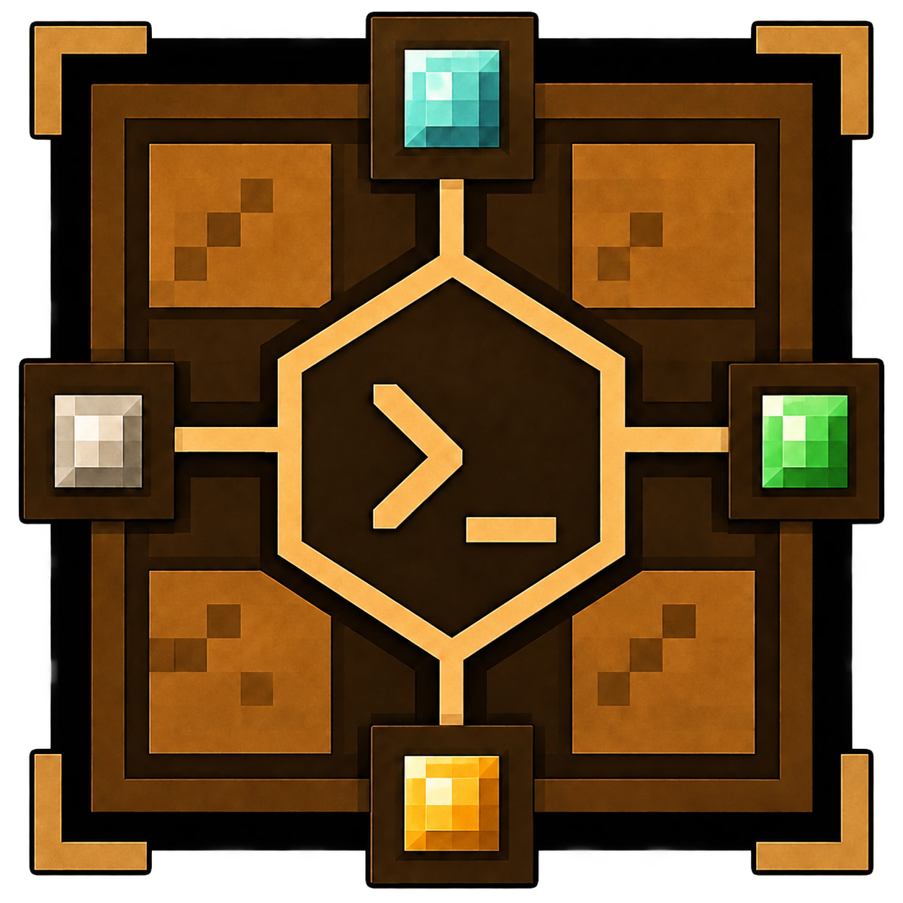
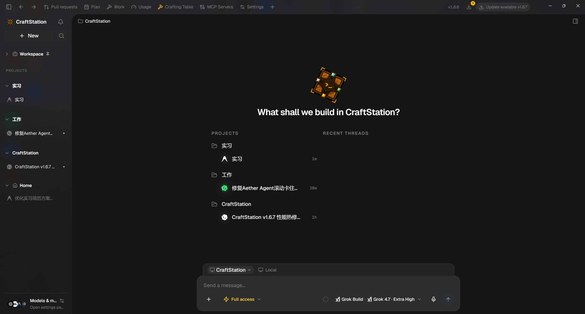
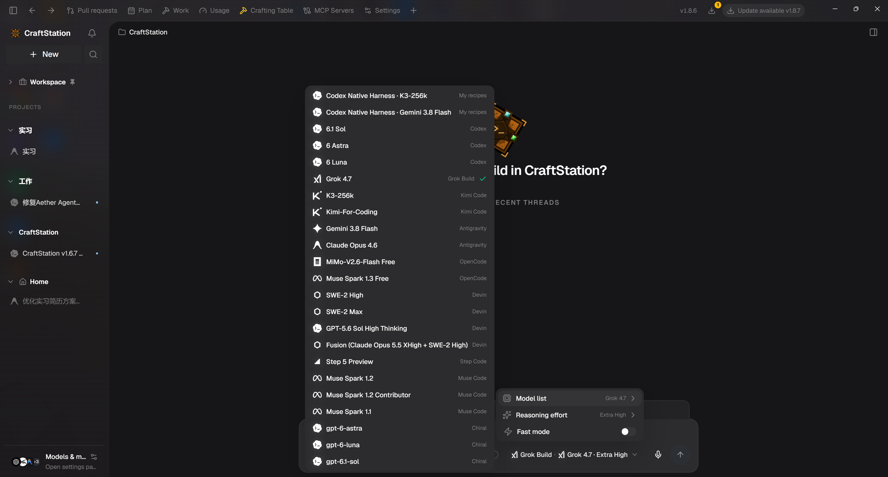
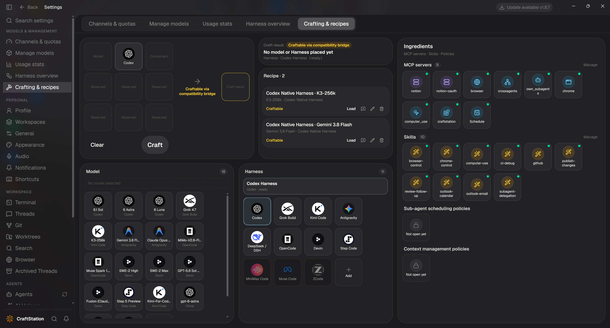
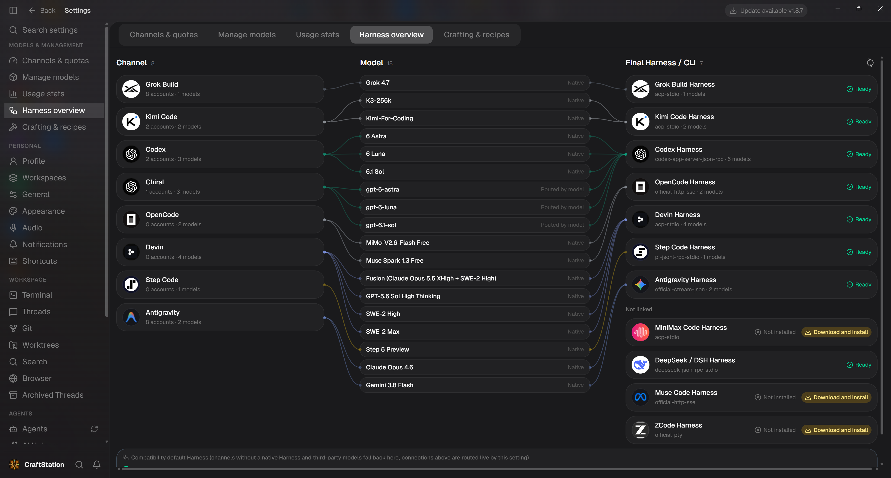
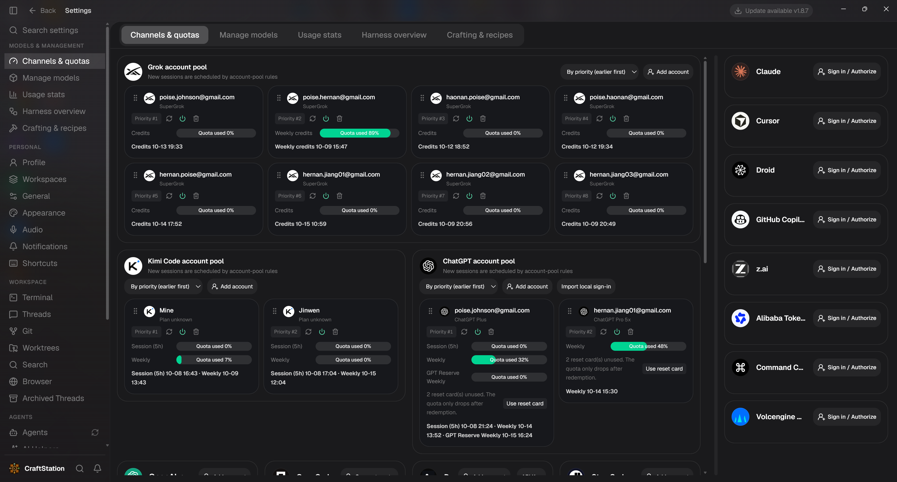

  

<h1 align="center">CraftStation</h1>

  <strong>选模型，配运行时，合成你的 Agent。</strong> 
  Agent Runtime Composition System 
  把喜欢的模型与 Harness 组合起来，让配方真正开始干活。

  <a href="./README.md">English</a>
  ·
  <a href="https://github.com/HernanJiang/CraftStation/releases/latest">下载</a>
  ·
  <a href="./LICENSE">Apache 2.0</a>

<em>HernanJIANG</em>

---

**把你想用的 Agent 组合出来。** CraftStation 将模型、Harness、账号、MCP 服务器和 Skills 带进同一个桌面工作区。用 **Auto** 沿模型的原生运行路径直接开工，也可以在合成台指定 **Model × Harness**，保存为 **Recipe（配方）**，在不同项目中反复使用。

借鉴 Minecraft 的合成系统，CraftStation 把组合变成可执行的流程：选择 Item，形成 Recipe，由 Crafter 编译计划，再启动为 Entity，在连续的 Session 中工作。Harness 就是驱动 Agent 的运行时，负责执行循环、上下文和工具。

  

<em>项目、最近线程、运行环境、权限和 Agent 选择，都在开始任务时触手可及。</em>

## CraftStation 的独特之处

### 一个模型入口，调动整个工作区的 Agent

在同一菜单中选择 **Codex、Grok Build、Kimi Code、Antigravity、OpenCode、Devin、Step Code** 等已接入 Harness 的模型。保存的 Recipe 与模型一起出现，让你亲手合成的组合成为日常随时可选的 Agent。

在当前项目中切换 Agent、跟进输出、查看工具活动。选择适合任务的运行时，继续在熟悉的工作区里干活。

  

<em>原生模型与自己的 Recipe 共用一个入口，每个选项背后的 Harness 清晰可见。</em>

### 合成一个好用的组合，保存后随时再用

合成台把 **Model × Harness** 的组合过程摆到眼前：选择原料、查看兼容状态，把可合成的结果保存为 Recipe。旁边的原料清单展示可用的 MCP 服务器和 Skills，并提供管理入口。

截图中展示了 **Gemini 3.8 Flash × Codex Native Harness** 和 **K3-256k × Codex Native Harness** 等配方。在支持的跨厂商组合中，需要时通过兼容桥连接；CLIProxyAPI 负责渠道与 API 兼容，选定的 Harness 继续负责运行 Agent。

把适合自己的组合保存一次，下次直接从首页模型菜单选用。

  

<em>给 Agent 的合成方格：模型与 Harness 原料、可复用的配方，以及一目了然的 MCP 和 Skills 清单。</em>

### 模型背后，谁在真正执行，一眼看清

Harness 总览把 **渠道 → 模型 → 最终 Harness / CLI** 连成可视路径。模型来自哪里、实际由哪个运行时执行、运行时已就绪还是需要安装，都能在同一张图中看清。

**Auto** 沿模型的默认原生路径运行，例如 GPT → Codex、Kimi → Kimi Code、Gemini → Antigravity。Agent Loop、上下文管理、工具执行、MCP 和 Skills 继续由官方运行时拥有；显式 **Recipe** 则让你自行选择受支持的组合。

  

<em>沿连接线追踪账号渠道、模型和执行运行时，同时查看可用状态。</em>

### 多个账号，一处掌握额度与调度

在支持账号池的渠道中集中管理多个账号，包括 **Grok、Kimi Code 和 ChatGPT**。会话或每周额度、重置时间、账号优先级和启用开关集中展示。

新会话按账号池规则调度。按优先级排列账号，当前账号因额度或可用性无法继续时，由账号池切换到其他符合条件的账号。开始下一项任务前，就能看清哪些账号还有余量。

  

<em>多个账号、剩余额度与调度顺序，在「渠道与额度」页面统一管理。</em>

## 让工作持续推进的工具

- **跨线程协作**：Agent 通过内置 MCP 工具把任务交给其他 Session，也可以新建线程开展工作。
- **Schedule**：在指定时间或按间隔唤醒线程，继续推进任务。
- **浏览器与 Computer Use**：为兼容的 Harness 提供浏览器工具和 Windows 桌面操作，包括点击、输入和截图。
- **Skills、MCP、Git / worktree**：在同一个桌面中管理能力与项目工作流，支持项目绑定和兼容的工具注入。
- **CLI 更新**：从标题栏检查、更新已安装的 CLI；在 **设置 → Agents → 一般 → 自动更新 CLI** 中控制自动更新，受管理的账号配置目录中的 CLI 副本也会同步更新。

## 开始使用

**[下载最新版本 →](https://github.com/HernanJiang/CraftStation/releases/latest)**

1. 选择 **Windows x64 安装包**（`CraftStation-Setup-…-x64.exe`）或 **便携版**（`CraftStation-Portable-…-x64.exe`）。安装包按向导安装；便携版双击即可运行。
2. 打开 CraftStation，连接你的账号。Agent CLI 使用官方工具和你已有的订阅，按需安装或授权想用的 Harness。
3. 打开项目，用 **Auto** 选择模型或选用已保存的 **Recipe**，发送第一个任务。

Windows 包已包含桌面运行时和 CLIProxyAPI 兼容桥，无需另外配置 Electron 或 Node.js 即可运行应用。各版本提供的平台与下载文件以发布页面为准。

## 许可证

Apache License 2.0。Copyright HernanJIANG。
