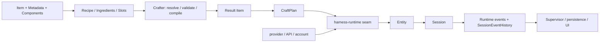

# CraftStation v1.4.0 架构、功能保全与性能实施报告

> 这是第一轮实施快照。第二轮的凭据复用、实际 CPA 回答、权限/文件修复、资源指标及最终提交状态见 [第二轮报告](report_1.4.0_round2.md)。本页“未 push / 未打包”等描述只对应第一轮时点；IPC schema 在第二轮增加可选的用户消息关联 ID，不移除原有接口。

日期：2026-09-19。状态：**候选代码已实现；自动检查与有限真实运行已执行；外部功能验收未全部完成，尚未合入 main 或发布。**

实施工作树：`D:/Work/CraftStation/.worktrees/1.4.0-architecture-performance`，分支 `dev/1.4.0-architecture-performance`。起点为 main 的产品版本 `1.3.4`，工作树 `package.json` 改为 `1.4.0`。未 merge、push、tag，未制作安装包。根工作区原有三份研究文档保留，复制进工作树作为研究基线，内容不改。

本轮完成跨六种 Session 实现的历史管理统一、类型化路由决策、重试/重建/Stop 的生命周期归一，以及协作投递、文本保全、诊断隐私、remote 边界和 Kimi 凭据缺陷修复。没有试图把所有 Harness 压成一个协议，也没有实现未立项的学习路由、完整 Recipe Graph 或 Agent Loop。

## 1. 交付与证据入口

| 产物                                                                                                                      | 用途                                                                 |
| ------------------------------------------------------------------------------------------------------------------------- | -------------------------------------------------------------------- |
| [逐项保全账本](report_1.4.0_coverage.md)                                                                                  | 全部 1,277 个原始 ID 的状态、限制与原文入口；追加本轮发现            |
| [机器可读账本](report_1.4.0_coverage.json)                                                                                | 每行完整原始需求/历史版本/边界、当前源码入口、声明保留检查及测试分组 |
| [测试清单](report_1.4.0_tests.json)                                                                                       | 每个测试文件实际结果、最新定向复验结果、跳过用例名称                 |
| [验证摘要](report_1.4.0_evidence.json)                                                                                    | 基线失败处置、性能原始采样、GC 可达性、UI 与真实运行范围             |
| [架构研究](research_1.4.0_architecture.md)、[功能矩阵](research_1.4.0_features.md)、[版本历史](research_1.4.0_history.md) | 用户给定的研究基线，方案不是实施约束，旧 PASS 不作为当前验收         |

账本覆盖 235 项细分功能、344 个 IPC、169 个 MCP 工具、121 个设置键、181 条历史防线、9 个不确定项和 218 条继承 changelog 记录。**编号覆盖完整不等于所有功能均已端到端验收。** IPC/MCP/settings 的声明文件均未修改，逐项名称仍在；handler 的行为用相关测试及真实运行单独说明，不能由声明存在推断功能通过。

## 2. 最终架构与保留边界



- `Ingredient` 仍是 Item 的输入角色，`Result` 仍是 Item；Metadata 不承担 runtime 逻辑。Crafter 不启动进程、不做 RPC/IO。
- Model Vendor、Harness Vendor、账号与 Session 身份继续分离。确定性的是解析决策，执行时的 CraftPlan/Entity/Session 身份仍独立生成；没有为了缓存改成重复执行共用 UUID。
- Registry 与 AgentAdapter registry 保持不同职责。Auto 路由偏好、显式 Recipe、兼容 allowlist、精确 readiness、Windows/WSL 以及失败关闭语义保留。
- 官方 Codex app-server、JSONL/JSON-RPC、原生 Session/请求/Agent Loop 留在 native runtime 内；没有回退到 legacy ThreadSessionManager 来统一 Codex 的核心能力。
- Craft-Harness 的通用机制继续放在外围。本轮将 **TSM structured 路径** 的网络重试、transport 重建及恢复回放汇入同一队列；配额/鉴权仍由账号池或失败关闭机制负责，用户 Stop 不重试，PTY-only 没有被虚构为具备 per-turn 信号。
- **实查限制：** `supervisorRuntime` 的独立 `craftAgent/resumeCraftAgent` native 调用链仍直接调用对应 Session 的发送接口，不经过本轮 `TurnRetryCoordinator`。不能据发行说明的“跨 Harness”措辞宣称这条独立链已取得同等重试覆盖。

本轮选择窄接口逐步替换，没有搬迁整个目录或引入统一大管道。不同 provider 的权限、思考、事件、MCP transport、原生恢复和账号 quirks 保留在原 owner；`compatibilityBridge` 的事件语义不同，未强行并入六 Adapter 的存储替换。

## 3. 实际代码变更与缺陷闭环

### 3.1 历史存储与快照

新增 [sessionEventHistory.ts](../../src/supervisor/runtime/sessionEventHistory.ts)，Native Codex、Native Harness、Structured、PTY、DeepSeek API、OpenCode Native 六类 Session 共用。此前每次广播创建 snapshot 都复制 events/nativeEvents/diagnostics 全量数组，长会话的增量输出不断重复复制旧历史。

新实现按 128 项分块追加；snapshot 在创建时捕获固定前缀，读取数组时再物化。保留 enumerable 字段、数组接口、完整事件顺序、原生 envelope、diagnostics、浅拷贝及 JSON/structuredClone 行为。不会因性能优化截断历史，旧 snapshot 稍后读取也不会混入新事件。

旧 snapshot 只指向过去的块，避免闭包引用整个活跃 history 而保活未来全部事件。首次物化后释放块引用；未读快照至多额外保留同一尾块的 127 个后续事件。测试覆盖空历史、跨块、重入、数组修改隔离和 131,201 条超长历史。

调用者审计确认主事件订阅消费增量；六类 sendPrompt 订阅也消费事件，其他 getSnapshot 使用 session/status 等字段，没有发现每个 delta 读取完整历史的生产热点。**公开接口仍允许全量读取，性能代价见第 5 节。**

### 3.2 路由契约与确定性键

[executionRoute.ts](../../src/shared/crafting/executionRoute.ts) 新增类型化 `ExecutionRouteReasonCode`，路由布尔值由 `routeType` 一处派生；[compatibility.ts](../../src/shared/crafting/compatibility.ts) 根据稳定 reasonCode 选择兼容说明，避免通过英文文案 `includes` 决定业务语义。

保留原优先级、native/compatibility 路线、第三方来源与所有失败守卫。resolution key 改为固定六 Slot tuple 的 JSON 序列化，避免缺槽、分隔符嵌入 Item ID 引起碰撞；此键是内部 opaque key，不修改持久 Recipe ID 或执行 UUID。

### 3.3 重试、重建、Stop 与 goal 保全

相关实现位于 [threadSession](../../src/supervisor/runtime/threadSession/)：

- `TurnRetryCoordinator` 在延迟前后核验 turn generation、当前 Session 与用户中断。transport 故障的 `ignoreExit` 不能被错误解释成用户取消。
- `SpawnPipeline.restartThread` 在 dispose/create/activate/open/MCP 等异步边界核验 generation 与实例 ownership，过期替代 handle 释放，不激活。
- 恢复回放重新进入 `StructuredTurnQueue`，共用账号池失败切换 → 网络/transport retry → 明确失败的分流；不再绕过统一错误链。
- `retryContext` 与完整 `historyPreface` 分离；原生 resume 可以省略完整历史，但继续传续接提示、goal、附件与关联 ID。已绘制用户消息不会重复绘制。
- Stop 使 generation 失效；重建取消后清理 disposed handle，允许下一次输入恢复；迟到的 NoActive/interrupt 回执不能收尾已开始的新回合。
- steer 准备完成时若已处于中断中，不重复发中断；用户主动 Stop 仍保留独立行为。

定向用例覆盖 delay 中 Stop、标志复位但 generation 已变、旧回合 recovery、goal 延续、重建四阶段 Stop 后再输入，以及旧 handle/旧 Session 的迟到回执。没有通过忽略失败、扩大自动重试或删降级分支修绿测试。

### 3.4 协作即时注入与 durable queue

[ThreadControlAdapter](../../src/main/thread-collaboration/ThreadControlAdapter.ts) 保留当前产品的 busy/attention 即时注入尝试；未知 session 仍可恢复。删除“任何发送错误都强制 interrupt 再发送”的危险兜底：网络报错时原发送可能已经接纳，盲目补发会重复或打断目标任务。

[ThreadCollaborationService](../../src/main/thread-collaboration/ThreadCollaborationService.ts) 只在 `THREAD_TARGET_BUSY`、`agent_busy`、`THREAD_TARGET_NEEDS_ATTENTION` 这些明确未接纳的协议结果下退回 `queued/needs_attention`。配额、鉴权、网络及未知失败仍明确失败；显式 `interrupt-and-send` 仍保留。

[ExchangeRepository.deferDelivery](../../src/main/thread-collaboration/ExchangeRepository.ts) 在同一 SQL CAS 校验状态、claim token、未交付与租约未过期。旧 claim、已取消、已交付及“到期但 sweep 尚未执行”的记录不能复活。主协作服务、MCP tools 与 peer message bus 测试一起通过；没有把旧 busy 必排队的断言强加给后续已允许即时注入的产品合同。

### 3.5 有效文本与诊断

- [nativeAdapter.ts](../../src/supervisor/runtime/nativeHarness/nativeAdapter.ts)：普通 text delta 不做最终快照去重；仅 Antigravity `result` 信封补最终余量。DeepSeek 原先失败的 max-tokens `hellohello` 断言原样保留并通过；重复片段 `hello/hello`、`hello/lo` 与最终 replay 分开验证。
- [skillCatalogDump.ts](../../src/shared/skillCatalogDump.ts)：普通六个英文词不能仅凭词数被吞掉。显式目录头、足够技能 ID 或纯 skill-chip 目录仍过滤；带合法正文的技能内容保留。
- [structuredRuntimeDiagnosticError.ts](../../src/supervisor/runtime/threadSession/structuredRuntimeDiagnosticError.ts) 与 [sentry.ts](../../src/supervisor/diagnostics/sentry.ts)：限制任意 provider cause 文本向遥测投影；保留受控账号提示、稳定错误分类、phase/operation/status 与对象 ID。恢复失败日志不直接打印未知异常中的 prompt/凭据，原始运行失败仍进入正常错误处理 owner。
- [sessionHandoffActions.ts](../../src/renderer/actions/sessionHandoffActions.ts)：远程线程切换不误用本地 supervisor；remote procedure 分类补齐 `gitDescribe`、native-session DB mirror 和 local-only switch。
- 设置搜索索引补齐已存在的重试次数/间隔入口；异步 UI 发送错误有明确 catch/toast，避免未捕获 rejection。
- [autoUpdater.ts](../../src/main/updates/autoUpdater.ts)：截图复核发现开发模式“不支持更新”分支先返回错误，绕过自动检查静默约定。补齐 `automatic` 判断，手动检查仍明确反馈；对应 H160 的历史防线。

### 3.6 真实验证暴露的 Kimi 凭据问题

真实隔离应用导入宿主 Kimi profile 后显示 available，但启动返回 `Authentication required`。进一步只检查字段类型/是否为空，确认宿主 access/refresh token 都为空；不能把“JSON 文件存在”当作认证成功。

[kimiProfiles.ts](../../src/supervisor/runtime/kimiProfiles.ts) 因此补充：

1. 导入在创建账户行前拒绝空 token、仅 metadata、非对象 JSON；登录完成也不能把空凭据 promote 为 available。错误不带 token 内容。
2. 有效 OAuth 凭据若缺 `config.toml`，写入引用账户内 credential 文件的 provider/model 声明；旧 managed home 在启动时补齐。已有 OAuth 配置保持原样，API Key 原路径保持。
3. refresh-only 凭据仍可恢复；[kimiCredentials.ts](../../src/supervisor/runtime/kimiCredentials.ts) 不会因 access 为空提前放弃 refresh，也不把空 access 当 fresh token。导入 → quota collector → refresh → 账户内旋转写回有联动测试，原来源文件不改。

证据必须分开：**空凭据误报可用在真机复现；缺配置与 refresh-only 修复经测试证明；有效 Kimi 账号的真实成功回答未完成。** 两次真实启动看到的认证失败均不作为修复后成功证据。

## 4. 基线、测试与历史缺陷处置

初始全量共 11,796 项：11,666 通过、66 失败、64 跳过；25 个失败文件中包含 SkillsManager 的 suite 加载错误。为排除工作树后续修改干扰，在根 main 只重跑这 25 个文件，独立确认 66 个失败及对应 suite 错误。根 main 源码未改。

实施后全量：**1,089 个文件，11,846 项，11,781 通过、0 失败、65 跳过**。新增的性能测试默认跳过，通过显式环境变量另外运行。之后的 claim 到期、history 最终简化、OpenCode 临时工作区、Kimi 及更新静默增量分别做定向复验：55/55、最终 Kimi 77/77，更新相关 39/39。各组存在重叠，不能相加宣称额外独立覆盖；没有声称首次全量已包含之后新增的用例。

`pnpm typecheck`、`pnpm lint` 通过；`pnpm build` 已执行通过。最后一次生产改动后，三项检查再次以退出码 0 完成。测试期间有既有 React act 等 warning，不能描述为全程零 warning；lint 的 deny-warnings 门与 UI error collector 是不同证据。

| 基线类别                                                                                 | 本轮处置                                                                                                 |
| ---------------------------------------------------------------------------------------- | -------------------------------------------------------------------------------------------------------- |
| DeepSeek max-tokens 重复文本丢失                                                         | 修生产去重逻辑，保留原断言；对应 U004                                                                    |
| 普通英文 queue/notes 被技能目录过滤                                                      | 修生产判别，保留真实合法输入                                                                             |
| remote procedure 分类、设置 retry 搜索缺项                                               | 补生产分类和索引                                                                                         |
| collaboration/MCP/peer busy 旧期待与新即时注入冲突                                       | 保留即时注入、补明确拒绝后 durable fallback/claim 守卫，覆盖两种结果；对应 U002                          |
| runtime/spawn 测试继承宿主 MCP URL/token、设置、global prompt、skills 目录               | 隔离测试环境与数据根；断言不再依赖用户机器配置，凭据不输出                                               |
| app/sideChat 缺 `dismissTaskbarAttention` mock；SkillsManager toast mock 破坏 `getQueue` | 修夹具接口，保留生产功能                                                                                 |
| ThreadGoalDock fake timer 与 waitFor 卡住                                                | 只 stub Date.now，继续测试真实 UI 更新                                                                   |
| 旧 registry=7、agent status schema=13、context 计算等断言                                | 对照当前 9 个 Harness、schema14、输入占用/计费用量分离修夹具；不缩减目录和计费信息                       |
| /goal、Stop loading、退役 unload/CraftStation mode 菜单断言                              | 按当前 UI 生命周期测试；卸载 action/runtime、终端能力、持久 goal 保留，未恢复旧外观覆盖新需求；对应 U003 |
| one-shot 假定所有 provider 支持、git resolver 机器相关                                   | DeepSeek ACP-only 明确非 headless；测试 mock 可执行查找，Windows resolver 另有专测                       |
| lint/type fixtures                                                                       | 补 vi.fn 类型、消除变量遮蔽/重复 import、保留 error cause；不改变业务能力                                |

65 个跳过项逐名见测试清单，包含 macOS/POSIX/WSL 条件、真实 provider/跨 Harness/账号池/兼容桥、SSH、Computer Use 真 GUI、render artifact 及 opt-in benchmark。**没有以 test skip 关闭历史真机门。**

按 `code-review` 技能做了独立 Standards/Spec 只读审查。修复了 snapshot 保活、日志隐私与 ID、retry/restart 代际隔离、goal/retry owner、Stop 后 handle、协作租约到期及 refresh-only quota 等 finding。审查结论仅覆盖该 diff，不代表全部历史功能真机验收。

## 5. 性能前后对照及代价

方法：Windows、Node `v24.18.1`；同一个 [sessionBroadcast.perf.test.ts](../../src/supervisor/runtime/nativeCodex/sessionBroadcast.perf.test.ts)，单 worker，1 次预热 + 5 次采样取中位数。通过真正的 PassThrough → JsonRpcTransport → AppServerClient → NativeCodexCraftSession 映射/广播链；只替换为 main 的原 Adapter 作前测，`finally` 恢复候选源码，再后测。运行时已停止本轮管理的 Electron 实例，避免编译/应用测量争用。它是本地生产链路基准，不含模型网络延迟，也不是整机 UI 帧率。

| 输入事件数 | 全量历史读取频率 | 改造前中位 ms | 改造后中位 ms | 前/后耗时比 |
| ---------: | ---------------- | ------------: | ------------: | ----------: |
|      1,000 | 不读；消费增量   |          5.00 |          2.98 |        1.68 |
|      5,000 | 不读；消费增量   |         27.37 |         13.61 |        2.01 |
|     15,000 | 不读；消费增量   |        170.73 |         43.39 |        3.93 |
|      1,000 | 每 100 条读一次  |          2.59 |          2.24 |        1.16 |
|      5,000 | 每 100 条读一次  |         23.30 |         12.80 |        1.82 |
|     15,000 | 每 100 条读一次  |        162.39 |         42.08 |        3.86 |
|      1,000 | 每条都读         |          2.08 |          3.15 |        0.66 |
|      5,000 | 每条都读         |         26.36 |         81.60 |        0.32 |

比值大于 1 表示该场景更快，小于 1 表示更慢。每个场景验证所有 Runtime events 与 native envelopes 均保留；输入数之外的一条原生初始化映射事件也保留。

**不可隐藏的退化：** 每条事件都读取完整历史时，分块物化比原数组 slice 慢，5,000 条场景约需原耗时 3.10 倍。本轮生产订阅审计未发现这种热点；保留这个基准作为未来消费者变更的告警条件。没有保留额外 WeakRef/全量缓存来追逐该压力场景，以避免新增长生命周期引用与复杂度。若未来 UI 引入全量高频读取，应重新测量并选择增量消费或有明确失效规则的缓存，不能只引用本报告的 3.9 倍收益。

[GC 可达性脚本](../../scripts/measure-session-history-memory.mjs) 在 snapshot 之后追加 512 个事件、丢弃活 history、显式 GC：已物化快照保活后续事件 **0**，未物化快照最多保活同一尾块 **127**。这是对象可达性守卫，不是 Electron RSS 减少 多少 MB 的证明。没有宣称网络、启动、全 UI 或所有 Harness 都获得同等加速。

## 6. UI、真实运行与未验证门

应用均由 interactive-testing managed launcher 创建，使用工作树构建、独立端口/DB/profile 和一次性 project；没有连接用户现有应用端口或结束其进程。真实模式读取宿主已有凭据，通过产品导入接口进入隔离账号目录；没有在报告输出 token/key/prompt 正文。用作 smoke 的 marker 是专用无敏感测试文本。

完整 mock smoke 使用真实 Electron 与生产 IPC/文件操作，但 provider 状态夹具属于 mock，不能替代真实 Agent 回合。修复测试脚本的英文 locale、Plan 新入口、Auto 模型 selector、Claude skill invocation 以及终端入口旧假设；不为旧 selector 改产品行为。Windows 窗口被遮挡时先通过 owned `focusWindow` 让输入与菜单动画真实执行。

末次独立应用的生产 IPC 确认：空 Kimi 凭据被拒绝；automatic 更新检查保持 idle 且无开发模式错误 toast，手动检查返回 error 并显示说明。画面见 [最终自动检查静默截图](report_1.4.0_assets/final-automatic-quiet.png)。

最终完整 mock smoke **9/9 自动场景通过、16 个 mock 集成门、renderer error 0**。随后截图发现并修复的 automatic 更新提示另做定向 UI/IPC 复验，未把较早截图当作该修复后的画面。入口、设置/控件几何、Schedule 创建/显示/暂停/删除、GitHub Actions 页面、线程搜索、浏览器、Skills 管理/导入/启用/删除均有对应自动证据；mock 的权限/远程/真实 provider 名称只是契约检查，绝不提升为外部门 PASS。

真实运行结论：

| 门                                                                          | 本轮结果                                                                                                                                                                           |
| --------------------------------------------------------------------------- | ---------------------------------------------------------------------------------------------------------------------------------------------------------------------------------- |
| Codex 官方 native 首轮                                                      | 创建实际 Session 后返回 usage limit；没有成功助手回答。记录为 `BLOCKED_EXTERNAL`，错误可见为防线证据。                                                                             |
| Kimi import / 首轮                                                          | 复现空凭据 available 后 `Authentication required`；已修导入与登录完成校验。有效凭据 live 未验。                                                                                    |
| 后续轮、用户问题、权限拒绝、steer、Agent Stop、实时换模型、重开原生 Session | Codex 配额、Kimi 凭据前置未满足，`NOT_RUN/BLOCKED_EXTERNAL`；不把标题里的 marker 当助手回答。                                                                                      |
| 真 PTY                                                                      | UI 打开终端并取得真实输出；另一次真实 IPC 启动中断 Start-Sleep 后收到下一条命令输出，正常关闭。resize 请求可提交，但 shell 的 readTerminalSize 返回 null，未宣称精确尺寸回读通过。 |
| OpenCode 六路线探针                                                         | 真实本地 server/session 创建与预期认证/模型错误收敛通过；使用独立临时目录，不再使用旧工作树。**不代表六个 provider 成功回答。**                                                    |
| 双 Harness handoff / 跨线程真实协作                                         | `NOT_RUN`，相关 contract/单元测试通过不能替代实测。                                                                                                                                |
| 浏览器扩展、Chrome、Computer Use 真 GUI、remote/mobile、SSH                 | mock/相关 suites 有证据；本轮相应真实外部门未完成。                                                                                                                                |
| GitHub Actions 外部操作                                                     | 隔离配置无 GitHub 登录；仅 UI/契约，未执行真实 rerun/delete。                                                                                                                      |
| quick composer 全局快捷键                                                   | 与已有应用的 Ctrl+Alt+Space 占用冲突；保留用户进程，真实门未验。                                                                                                                   |
| 打包与发布                                                                  | `pnpm build` 是工程构建；NSIS、portable、更新 feed 与安装包真启动未做。                                                                                                            |

完整逐场景 UI 结果、路径和截图索引写入验证摘要。所有本轮管理的临时应用已按所属 session 停止；保留隔离测试产物供复查。历史中 Muse 排序、Devin 无权威个人额度数字、跨厂商 Recipe 实际 identity 等限制没有被删掉或假定关闭。

## 7. 版本演进与后续验收边界

H001–H181 按原 Feature/Fix Cycle/公开 Release 归属保留；UP 的 22 个继承 changelog 版本、218 条记录全部保留。v0.2.0–0.2.16 连续迭代、v0.4 同号账号/Native 两套记录、v0.5 用户验收重开、Feature v1.3 Computer Use 与公开 1.3.x 都没有混并。当前 `1.4.0` 与继承的旧 `1.4.0` 属不同发布空间，**正式发版前仍需在 changelog 展示/标识上解决同号歧义，不能删除历史记录掩盖问题。**

U002/U003/U004 的既有失败已经按当前产品合同处置；U001/U006/U007 的真实组合、账号与连续性门保留待验；U005 保留上游限制；U008 已补本轮自动/测量/有限真实证据；U009 的未记录讨论仍是信息缺口。

建议下一阶段围绕真实有效账号补齐上述外部门，并以 profiler 决定新的优化点。可以继续拆模块、选不同结构或改事件接口，但要保留逐项账本、版本归属、降级分支和新回归样例。本轮没有用“统一架构”作为重写厂商核心特性或抹平边界状态的理由。

## 8. 复验命令

在本版本工作树执行；真实运行使用 managed session，禁止裸启动后猜端口：

```powershell
pnpm typecheck
pnpm lint
pnpm test --maxWorkers 6
pnpm build
node .agents/skills/interactive-testing/scripts/run-craftstation-smoke.mjs --scope full --mode mock
$env:CRAFTSTATION_SESSION_BENCHMARK = "ai_workspace/validation/1.4.0/perf-repeat.json"
pnpm exec vitest run src/supervisor/runtime/nativeCodex/sessionBroadcast.perf.test.ts --maxWorkers 1
Remove-Item Env:CRAFTSTATION_SESSION_BENCHMARK
node --expose-gc scripts/measure-session-history-memory.mjs ai_workspace/validation/1.4.0/memory-repeat.json
```

性能采样应与构建、全量测试、应用 smoke 串行，且不能拿默认 skip 的 benchmark 充当测量。真实 provider 验证在满足可用凭据/配额后继续执行，结论按实际回包与原生 Session 身份记录。
