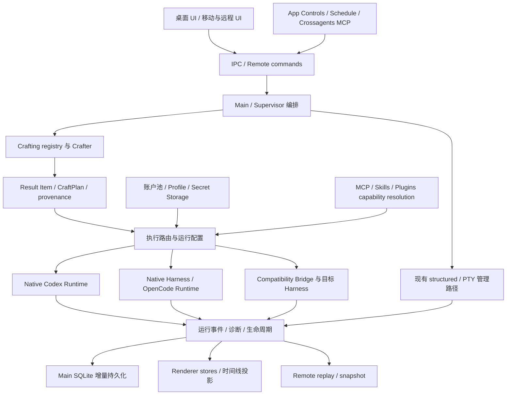

# CraftStation v1.4.0 架构统一、冗余治理与性能优化研究指导

> 编制日期：2026-09-19。研究基线：Product Git Root 的 `main`，`package.json` 为 `1.3.4`。目标版本：**1.4.0**。
>
> 本文是研究与实施指导，不是已完成重构的报告，也不代表已启动版本开发、完成验收或发布。此次只新增文档，不修改产品源码、数据、配置或版本号。

**核心建议：以 Item → Recipe → Result Item → CraftPlan → Entity → Session 的领域语义统一决策与执行契约，以已有真实功能和历史缺陷作为验收约束，让实现 Agent 自主选择模块结构、算法和迁移顺序。** 优先消除同一业务事实的多处判断、生命周期责任不清和重复状态传播；性能优化以测量为依据，不以删功能、减少上下文、隐藏错误或降低可靠性换取指标。

本交付由以下三份文档共同组成；交给实施 Agent 时应完整提供：

| 文档                                                 | 用途                                                                 |
| ---------------------------------------------------- | -------------------------------------------------------------------- |
| 本文                                                 | 领域模型、现状与可能方案、除重候选、性能研究、迁移与验收规则         |
| [现有功能与隐式契约矩阵](research_1.4.0_features.md) | 按稳定功能编号追踪正常行为、边界、源码与测试入口，防止只保留主要页面 |
| [版本演进与 Bug 防御清单](research_1.4.0_history.md) | 逐版本及修复轮次追踪增量能力、问题、历史防线和未来回归场景           |

本轮盘点形成 **235 条业务功能、344 个 IPC 入口、169 个内建 MCP 工具声明、121 个顶层持久设置**；历史附录形成 **181 条功能/缺陷防御记录与 9 项证据盲区**，并保留继承 changelog 的 **22 个版本、218 条原始条目**。这些数量表示可追溯的盘点范围，不表示已经执行了相同数量的验收。

## 1. 任务边界与证据解释

### 1.1 必须达到的结果

1. **零功能缩减**：保留用户入口、工具入口、持久数据、后台行为、错误提示、恢复路径、平台差异、隐式降级与能力隔离。实现可替换，行为必须有接续者。
2. **允许修正错误行为**：历史错误、串号、状态误判、丢附件、卡死、重复通知等不属于需要保留的功能。修复必须说明正确契约，并用反例证明不会伤及合法场景。
3. **历史缺陷强制核验**：附录的每条防御记录都需要 disposition 和证据；不能因原文件被删除、实现被重写或旧测试不再适用而免检。若复发，实施 Agent 在当前改动中修复并补齐行为层回归保护。
4. **充分设计自由**：目录、类名、设计模式、内部数据结构、同步/异步实现、缓存策略、数据库访问方式均可讨论。本文的候选方向不是硬编码架构蓝图。
5. **保持产品定位**：CraftStation 是 Agent Runtime Composition System。统一的对象是组合决策、运行管理与使用体验，不能把不同 Harness 的原生能力压扁为最小公共聊天接口。

“可合并功能”在本任务中指**多个功能共用实现，同时各自保留行为与入口**；不表示取消其中一个功能。删除重复实现、无调用分支或已被等价替代的代码之前，先证明它没有承载独有契约、迁移、恢复、平台兼容或外部调用。

### 1.2 本次研究做了什么，尚未做什么

- 检查 Git 状态，研究开始时 `main` 工作区干净；检查 `codegraph status`，索引项目为 `D:\Work\CraftStation`，当时报告 up to date。
- 读取领域约定、当前状态、历史计划/实现/复审/验收/发布记录；以源码、测试定义和一方技术资料校对重要结论。
- 针对组合编译、执行路由、运行时接口、重试、能力注入、事件处理、SQLite 增量写入、渲染与缩放等读取实际实现。
- **没有运行全量测试、真机验收、性能基准或逐个供应商付费请求。** 历史 PASS 是当时证据，不能替代 v1.4.0 的验证；源码中存在测试不等于本轮测试已通过。
- 附录是当前仓库可追溯的功能基线，不声称覆盖未写入仓库的全部口头讨论或用户环境中的全部状态。实施发现新功能时，应先补入矩阵再改实现。

证据分级：**源码事实**＝本轮可定位的实现；**历史事实**＝当时文档/提交记录中的报告；**推断/候选**＝值得测量或验证的方向；**待验**＝没有当前运行证据。没有性能采样的数据，不写成“已确认性能瓶颈”。

### 1.3 防止历史命名混淆

- 以 [AGENTS.md](../../AGENTS.md) 的长期约定、[PROJECT_STATUS.md](../../PROJECT_STATUS.md) 的当前状态和现有实现识别现状；旧计划只是历史输入。
- `website/public/changelog.json` 中存在继承项目的旧版本序列，包括早于当前重构路线的旧 `1.4.0`。**目标 CraftStation v1.4.0 不等于该旧条目**；附录分别记录，不按版本字符串直接合并。
- `manager/coder/debugger_X.Y.Z.md` 的编号有 Feature 与互审 Cycle 语义，不自动等于 GitHub Release。`PASS`、用户重开、后续关闭须按时间阅读。
- 例如 v1.2 计划曾把正式 Computer Use 排除在当期范围外，后续已有实现；不能拿旧 non-goal 删除现在的能力。旧 Efficient/Creative 文案也不能覆盖当前面向用户的 Auto/Recipe 约定。
- README 的下载链接可能落后于 `package.json`；文档之间的滞后不是回退产品能力或认定最新版本的依据。

## 2. Minecraft 领域模型应统一到什么程度

### 2.1 概念必须统一，实现不必强行一致

| 正式术语                 | 当前含义与现有承载                                                   | v1.4.0 不可破坏的语义                                             | 可研究的实现自由                          |
| ------------------------ | -------------------------------------------------------------------- | ----------------------------------------------------------------- | ----------------------------------------- |
| `Item`                   | 可独立选择、替换和组合的最小决策单位；`src/shared/crafting/types.ts` | identity、version、vendor、来源和能力可追溯                       | 注册结构、索引、schema 扩展与加载方式     |
| `Metadata`               | 身份、显示、版本、来源等描述信息                                     | 不承担进程执行；不携带凭据明文                                    | 展示投影、规范化与缓存                    |
| `Component`              | Item 的属性、能力、行为和实现描述                                    | 与底层 Plugin/Adapter 区分；能力不能只在 UI 上存在                | 类型化的能力描述、组合校验                |
| `Ingredient`             | Item 在特定 Recipe 内的输入角色                                      | 同一 Item 可承担不同输入角色；不是 Item 子类                      | Slot 类型、角色验证、来源记录             |
| `Slot` / `Crafting Grid` | 用户选择与 `auto` 解析位置                                           | `auto` 是确定性解析模式；显式选择不可被偷偷替换                   | Grid 的内部表示及交互结构                 |
| `Recipe`                 | 输入如何组合为结果；有匹配与编译语义                                 | 用户保存的 Recipe 保持选定 Model × Harness 与相关配置身份         | 存储序列化、模板/实例分离、匹配算法       |
| `Crafter`                | `resolve → validate → compile`                                       | 不 spawn，不操作 transport/RPC/UI；同一有效输入解析规则稳定       | 注入 readiness 快照；内部纯函数或其他组织 |
| `Result Item`            | 可继续参与组合的结果；含 provenance/CraftPlan                        | 不能直接等同运行中的线程或进程                                    | 结果描述与执行实例解耦方式                |
| `CraftPlan`              | 秘密无关的执行计划与选定绑定                                         | model/harness/environment/account ref/override 等不能在启动时漂移 | 可序列化、可诊断、可迁移的版本策略        |
| `Entity`                 | Result 被 instantiate/spawn/start 后的实例                           | 独立生命周期与资源归属，不等于数据库 Thread 行                    | 进程池、资源 scope、启动编排              |
| `Session`                | Entity 的连续工作过程                                                | 多 turn、恢复、中断、原生 session identity 与上下文连续性         | Session handle、快照与事件接口            |
| `Thread`                 | 产品中的持续工作入口、历史和视图身份                                 | 可跨模型/Harness 切换及多个运行 segment；不必一对一绑定进程       | 读模型、持久化投影、UI 状态组织           |
| `RuntimeChatItem`        | 聊天事件中的消息/工具/思考等条目                                     | **不是领域 Item**；共享英文单词不代表可以共用领域生命周期         | 命名澄清和类型隔离，无需大面积改名        |

领域依据：[类型](../../src/shared/crafting/types.ts)、[运行接口](../../src/shared/crafting/runtimeInterface.ts)、[Crafter](../../src/shared/crafting/crafter.ts)、[聊天事件](../../src/shared/contracts/runtimeEvent.ts)。

账号、MCP、Skill、环境、权限可用 Item/Component 的语言说明“为什么参与这次组合”，但不要求把所有内部对象一次性改造成 Item。账号凭据仍归安全存储；Skill 文件仍有自身 origin 与投影生命周期；MCP transport 仍有协商、OAuth 和关闭语义。Minecraft 是组合语义，不是必须引入 ECS、游戏 tick 或全量 Recipe Graph 的技术命令。

### 2.2 需要同时保留的三条执行语义

1. **原生路径**：Model 与被验证的 Harness 组合进入官方 Runtime；其 Agent Loop、压缩、工具执行、原生 Skills/MCP/子 Agent 语义继续由 Runtime 拥有。
2. **兼容路径**：显式跨组合在能力验证后，经独立 Compatibility Bridge/官方 CLIProxyAPI 与目标 Harness 执行；桥不是 quota authority，也不替代目标 Harness 的 Agent Loop。
3. **第三方直连路径**：已验证的 OpenAI-compatible account 向支持自定义 Base URL 的目标 Harness 注入运行配置，不自动混入订阅池或强制走 CPA。

当前 [executionRoute.ts](../../src/shared/crafting/executionRoute.ts) 还包含 OpenCode 经过 allowlist/readiness 的原生服务分支。因此“同 vendor 就原生、不同 vendor 一律 CPA”不足以表达现状。路由研究必须保留来源渠道、模型身份、目标 Harness、环境和 readiness 的联合判断。

兼容状态也不是一套枚举到处复制：领域有 `NATIVE/SUPPORTED/EXPERIMENTAL/INCOMPATIBLE`；工作台有 `NATIVE/CRAFTABLE/IMPOSSIBLE` 的用户投影；诊断还可能表达 `UNAVAILABLE`。统一它们之间的映射和原因，不要求删除不同视角。[兼容解析](../../src/shared/crafting/compatibility.ts)

## 3. 当前架构与统一后的数据流

### 3.1 当前逻辑视图



图为现有职责概览，不表示每种入口都已经过同一条代码路径。`craftAgent` 与现有聊天启动路径、Native Codex 与其他 structured/PTY 路径仍需分别追踪。不能因为图上画了统一框就宣布实现已经统一。

主要证据：[SupervisorRuntime](../../src/supervisor/supervisorRuntime.ts)、[ThreadSessionManager](../../src/supervisor/runtime/threadSessionManager.ts)、[SpawnPipeline](../../src/supervisor/runtime/threadSession/spawnPipeline.ts)、[Native Codex](../../src/supervisor/runtime/nativeCodex/nativeCodexRuntimeAdapter.ts)、[Native Harness 工厂](../../src/supervisor/runtime/nativeHarness/index.ts)、[远程架构](../../docs/REMOTE_ARCHITECTURE.md)。

### 3.2 建议追求的职责视图，而非规定新目录


- **决策**回答“这次使用什么、为什么可执行、被拒绝的原因是什么”。
- **运行管理**回答“谁拥有资源、当前是哪次执行、如何启动/取消/恢复、错误交给谁处理”。
- **Adapter**回答“这个 Runtime 如何表达以上能力”，保留原生差异。
- **投影**回答“用户和其他客户端如何看到它”，不能反过来成为执行事实或秘密存储的权威。

“单一事实来源”应针对具体事实分配 owner：执行状态由对应 Runtime 管理；耐久记录由主进程数据库持有；UI 临时草稿由 UI 管理；provider usage 由真实采集与其时效语义决定。它不是要求建立一个包含所有对象的全局 Store。

### 3.3 三种可行路线，可混合采用

| 路线                        | 主要做法                                                                                         | 适用信号                                                           | 主要风险与验证                                                             |
| --------------------------- | ------------------------------------------------------------------------------------------------ | ------------------------------------------------------------------ | -------------------------------------------------------------------------- |
| A：在现有结构内加深 Module  | 保留对外 Interface，把 account、capability、failure、event projection 等同义决策集中到少数 owner | 多处修同一 bug、相同输入在不同入口结果不一致                       | 只搬文件却仍多份判断；以跨入口行为等价验证                                 |
| B：围绕执行身份统一生命周期 | 让准备、激活、取消、切换、恢复共享 execution identity 与资源归属；Adapter 保留原生扩展           | 迟到事件污染新 Session、Stop 后重发、退出资源残留                  | 中央编排膨胀；以故障注入、切换回滚、并发关闭验证                           |
| C：以计划和能力投影统一组合 | 强化 CraftPlan 的显式输入与可诊断解析结果，让 UI、工具、排期使用同一决策 seam                    | 工作台可用但运行不可用、配置开启却未注入、显式 Recipe 被 Auto 覆盖 | 为抽象而复制 registry、引入未立项搜索/学习能力；以原生/兼容/第三方矩阵验证 |

不预选 Strategy、Pipeline、actor、状态机库、事件总线或数据库替换。先用两种真实调用者检验 Interface 的价值：能否缩小调用者必须掌握的知识，并把错误和验证集中到同一 seam。Module 可以内部很复杂，但不应把所有分支作为十几个开关转移给调用方。

## 4. 零功能丢失的操作性定义

### 4.1 功能不是页面名称

同一个“聊天”至少涉及草稿、模型与档位、权限、附件、运行中 steer、队列、Stop、失败重试、同回合换号、问题/审批、思考/工具事件、上下文显示、滚动/缩放、历史恢复、跨 Harness 切换和通知。只证明“发一条消息有回复”不能代表这组功能保留。

完整分解见[功能附录](research_1.4.0_features.md)。以下是阅读导航，并非用导航替代细项：

| 功能域          | 必须覆盖的方向                                                                               |
| --------------- | -------------------------------------------------------------------------------------------- |
| 组合与目录      | Item/Recipe/provenance、Auto 与显式 Recipe、模型可见性、CLI 发现、就绪性、跨组合与失败关闭   |
| 会话与输入      | Thread/Entity/Session/turn、草稿与默认值、queue/steer/Stop、附件与 mention、原生恢复与切换   |
| 对话输出        | 多 stream、思考与工具顺序、数学/表格/代码/链接、工具分组、复制、错误和上下文用量             |
| 模型与账号      | 独立 Model/Harness vendor、每 provider 特性、profile 隔离、多账号优先级、额度、认证与代理    |
| 能力管理        | 外部 MCP/Skill 扫描导入、managed/plugin/built-in 来源、OAuth、过滤、投影与 portable fallback |
| 多 Agent 与计划 | 官方原生子 Agent、Own Subagents、持久 peer、三种地址、排期和运行记录                         |
| 工作区          | 项目、worktree、Git/PR、终端、文件树/编辑/LSP/搜索、Notes、Side Chat                         |
| 浏览与设备      | 内嵌浏览器、外部 Chrome、网页工具、Computer Use、坐标/权限/资源清理                          |
| 多端与系统      | 桌面/移动/远程/headless/relay/SSH、配对与 scopes、断线重放、通知、主题/语言/缩放             |
| 数据与分发      | 数据迁移、备份/恢复、secret storage、应用/CLI 更新、便携/NSIS、native ABI、退出与进程回收    |

### 4.2 每条功能的保留证据

实施 Agent 可自行选择记录工具，但每条功能至少能回答：

| 字段       | 要求                                                          |
| ---------- | ------------------------------------------------------------- |
| 功能编号   | 沿用附录编号；新增发现补编号                                  |
| 入口       | UI、IPC、MCP、远程、后台触发中哪些能使用它                    |
| 输入与状态 | 必填/可选/空值、权限、环境、账号与 Session 状态               |
| 可观察结果 | 成功、失败、取消、降级、持久化和通知                          |
| 替换映射   | 旧实现的行为现在由哪里承担；保留原实现也应明确                |
| 验证       | 契约测试、真实 UI、原生协议或产物证据的位置                   |
| 当前裁决   | PASS / FAIL / BLOCKED / 待验；不能用未解释的 N/A 覆盖已有功能 |

发现“代码存在但入口暂不可达”的功能，先排查 capability、平台条件、迁移、外部调用和隐藏设置；不能仅靠静态零引用判死。旧数据格式读入和 CLI 环境回退往往正是这种隐式功能。

## 5. 冗余与架构统一候选清单

以下是源码支持的研究入口；**没有完成语义等价证明的候选，不作为可直接删除的重复代码结论**。

| 编号 | 观察与证据                                                                                              | 可研究方向                                                                | 必须保留的差异/防线                                                                            |
| ---- | ------------------------------------------------------------------------------------------------------- | ------------------------------------------------------------------------- | ---------------------------------------------------------------------------------------------- |
| A01  | `SupervisorRuntime` 的 crafting 启动与 `SpawnPipeline` 都涉及账号、环境、MCP、Skills、quota 处理        | 准备执行配置的共用决策；先比较输入/输出，再决定是否共用 orchestration     | Native Codex 不回退 legacy；PTY 与 structured 的完成/中断信号不同                              |
| A02  | `resolveCraftingMcpServers`、`resolveCraftingSkills` 都调用 capability resolution；Adapter 还有各自投影 | 一次解析的不可变 capability 结果供多个消费者使用；统一未注入诊断          | 每次 launch 的设置、project、profile、platform 仍必须正确；OAuth 不得缓存过期                  |
| A03  | `executionRoute.ts`、registry、Harness descriptors、兼容能力表分别表达路由相关事实                      | 规范能力声明与生成/校验派生表，避免 allowlist 漂移                        | 模型来源、目标 Harness、第三方直连、OpenCode readiness 不得简化为 vendor 字符串比较            |
| A04  | `compatibility.ts` 通过英文 reason 的 includes 推导部分诊断码和中文文案                                 | 稳定 decision code 与展示翻译分离；统一错误投影                           | 现有可操作修复提示、安装 CPA 入口和不可执行原因要保留                                          |
| A05  | Renderer reducer 与 DB runtimeItems 各自处理 payload/context 合并、reasoning、request 终态              | 提取真正同义的纯转移规则，或用相同事件轨迹作差分测试                      | UI `observedLive`、时间戳与 pending request 的持久表示不等于 DB 行，不能强并为一份巨型 reducer |
| A06  | 通知、错误 toast、任务栏都分类线程变化                                                                  | 共用状态转移分类及去重事实，各端保留投影                                  | 焦点、mute、用户 Stop、完成、attention、点击消费标记的区别                                     |
| A07  | pool failover、网络重试、invalid session recovery、原生 respawn 均可导致重建                            | 建立明确的错误归属与执行接管契约，必要时统一取消和 attempt 记账           | quota ≠ auth ≠ transport ≠ capacity chatter；不允许多层同时重试                                |
| A08  | ACP capability advertised 与 verified assumed 存在低报修补                                              | 数据化记录来源与可验证覆盖规则；统一失败后摘除与通知                      | Devin 的实测 HTTP 支持、真实拒绝后的降级；不能全信广告也不能全强制开启                         |
| A09  | account/profile/authRef/provider identity 多处随启动与恢复传播                                          | 一个可审计的绑定结果与秘密解析 seam                                       | provider account 与运行 profile 不可混用；不得回读宿主全局凭据冒充选中账号                     |
| A10  | `interHarnessMessageBus` 与 Schedule 已共享地址解析；历史有多种 target 表示                             | 稳定 peer/thread identity 解析、绑定与查找规则                            | UUID、`thread:<uuid>`、`harness:nativeId` 指向同一目标；stop 不能创建会话                      |
| A11  | 桌面、远程和 headless 有共同工具/线程功能，但 composition root 不同                                     | 共用业务命令和契约，保留宿主资源创建                                      | headless 无 renderer 时仍可启动、鉴权、排期和落库；远程不能写本地无关 store                    |
| A12  | 工具错误字符串、诊断、toast、RuntimeEvent error 有不同出口                                              | 统一稳定 code/cause/correlation 与用户投影；先梳理所有出口                | 首个真实错误不被退出噪音覆盖，合法降级必须可见                                                 |
| A13  | 大型 `ModelUsageWorkspace`、`ThreadDraftView`、`ThreadComposerSection` 同时承载多项交互                 | 按领域决策/读取/编辑生命周期拆分深 Module；复用明确的 command             | 草稿、附件、默认模型和权限、队列编辑、失焦状态不可因拆组件重置                                 |
| A14  | Settings schema、provider adapter、UI 档位/权限显示共同描述能力                                         | 按能力声明派生显示和校验，未知枚举显式处理                                | provider 专属的 reasoning/service tier/permission option id 必须原样抵达 Runtime               |
| A15  | 多个 CraftSession 在 emit 时先 append event，再复制完整事件数组构造 snapshot                            | 将 delta 订阅与完整快照的成本分离，比较惰性快照、版本化快照或分段事件存储 | 订阅者的快照一致性、历史读取、诊断和恢复能力必须完整保留                                       |

重点源文件：[能力解析](../../src/supervisor/capabilities/capabilityResolver.ts)、[事件 reducer](../../src/renderer/state/slices/runtimeEventReducer.ts)、[DB 事件写入](../../src/main/db/runtimeItems.ts)、[账号解析](../../src/supervisor/runtime/accountResolver.ts)、[任务栏通知](../../src/main/taskbarAttention.ts)、[跨线程总线](../../src/main/thread-messaging/interHarnessMessageBus.ts)、[Schedule 协调](../../src/main/schedules/ScheduleRunCoordinator.ts)。

### 5.1 不应因相似外观直接合并的功能

- **Crafting registry 与 AgentAdapter registry**：分别回答“什么可组合”和“某协议如何执行”。可以映射，不能粗暴互替。
- **Native Codex 与 legacy Codex 适配器**：现有隔离是已明确的架构契约。不能为复用重新引入 `ThreadSessionManager/SpawnPipeline/CodexStructuredSession` 作为 Native Codex 的 fallback。[现有架构守卫](../../src/shared/crafting/boundaryGuard.test.ts)
- **Crossagents、Own Subagents、Runtime 原生子 Agent**：持久 peer、临时委派和供应商原生子任务的上下文/可见性/结束条件不同。
- **账户额度、当前上下文占用、token 消耗账本**：额度窗口、上下文容量与计费统计不是同一数值，刷新及缓存策略也不同。
- **内嵌浏览器、外部 Chrome、Computer Use**：WebContents、扩展连接、系统桌面的坐标、权限、会话和生命周期不同。
- **网络重试、额度换号、认证失败处理**：成功条件和允许副作用不同；共同的等待工具不等于同一恢复策略。
- **显式模型默认值与最近运行模型**：前者是用户偏好，后者是历史；已有 bug 正是把历史误当默认。
- **主进程持久化、远程快照、Renderer cache**：数据时效与权威不同。缓存不能反向覆盖已确认的执行事实。
- **memory-only Side Chat 与正式 Thread**：前者不落 SQLite/侧栏/搜索，升格之后才改变生命周期；统一存储不能顺手破坏这一契约。

### 5.2 大文件是调查入口，不是有罪证据

本轮源文件行数快照中，`supervisorRuntime.ts` 约 3,821 行、`ModelUsageWorkspace.tsx` 约 2,770 行、`spawnPipeline.ts` 约 2,294 行、`SkillsService.ts` 约 2,234 行、ACP `session.ts` 约 2,005 行。行数包含注释等，不等于复杂度或运行开销。

对这些文件应先问：它拥有几个不同生命周期？改一个业务事实需要触碰多少调用方？错误归属是否明确？测试是否只能 deep import 才能触发行为？可以保留大而有深度的实现，避免拆成大量只转发参数的小文件。

### 5.3 优先核实“策略已统一，路径是否真统一”

当前 `TurnRetryCoordinator` 的构造与 `tryTurnRetry` 接线可定位到 `ThreadSessionManager → StructuredTurnQueue`；`SupervisorRuntime` 另有创建和登记 `CraftSession` 的路径。仅凭“Craft-Harness 对所有 structured harness 生效”的历史描述，不能证明每个 crafted-native、compatibility、恢复和切换入口都实际穿过同一重试层。

这是**需要端到端追踪的覆盖疑点，不是本次已复现的线上缺陷结论**。应分别在各条路径注入网络/transport 失败，检查策略是否生效、Stop 是否取消等待、续接是否重复。如果确有缺口，补齐公共运行管理 seam，同时保持 Native Codex 的 legacy 隔离；不能通过强行改回旧管理器“实现统一”。MCP 注入与 pool failover 也应做同样的路径审计。[重试实现](../../src/supervisor/runtime/threadSession/turnRetryCoordinator.ts)、[队列接线](../../src/supervisor/runtime/threadSession/structuredTurnQueue.ts)

## 6. 生命周期、错误与契约统一

### 6.1 身份与上下文隔离

| 身份                                    | 必须区分的对象                        |
| --------------------------------------- | ------------------------------------- |
| `threadId`                              | 产品线程与用户历史                    |
| `resultItemId` / `craftPlanId`          | 组合产物与具体执行计划                |
| `entityId`                              | 一次运行实例                          |
| `nativeSessionRef` / `runtimeSessionId` | Harness 原生会话与平台执行会话        |
| `segmentId` / `bindingEpoch`            | 同一线程切换后的当前有效绑定          |
| `turnId` / attempt 信息                 | 用户的一次回合与该回合重试/换号的尝试 |
| `requestId`                             | 问答、审批、命令等需定向响应的请求    |
| `accountId` / `profileRef` / 环境       | 凭据所属账号、运行隔离配置与位置      |

当前 [sessionHandoff.ts](../../src/shared/sessionHandoff.ts) 已有 `segmentId/runtimeSessionId/bindingEpoch/eventSequence` 与 checkpoint。应沿这条既有事实研究，不另造平行 Session 宇宙。旧 segment 的晚到 delta、审批响应、错误和完成事件不能落到新绑定；旧 request 也不能误批准新 Runtime 的动作。

### 6.2 错误归属建议

| 错误或结果                      | 正确拥有者与用户结果                           | 重构应验证的反例                                        |
| ------------------------------- | ---------------------------------------------- | ------------------------------------------------------- |
| 输入/配方/兼容性不成立          | Crafter/route 返回稳定原因，不启动不可执行组合 | 不能为了“更健壮”偷偷换 Harness 或账号                   |
| 网络/transport 中断             | Craft-Harness 按策略重发或重建，保留续接语义   | Stop、过期 session、关闭、次数耗尽不能再发送            |
| 额度耗尽                        | pool 标记与换号策略                            | Kimi 403 quota 文案可换号；403 forbidden 仍 fail-closed |
| 鉴权/账单失败                   | 原因可见，按各自契约终止或引导处理             | 不能吞成通用网络重试；不能回落 ambient login            |
| provider 内部 capacity 重试信息 | 按已有语义作为状态/噪音处理                    | 不重复产生红色错误/重复计数，不掩盖真正最终失败         |
| MCP 部分不可注入                | 允许启动时明确披露本轮缺失项                   | 不能“面板已开＝成功送达”，不能日志泄露 token/header     |
| turn 已失败后进程 exit          | 生命周期清理，必要时 warning                   | 不覆盖原始错误，不多发合成 turn.completed               |
| UI command 拒绝/超时            | 局部错误提示，用户输入可恢复                   | 未处理 Promise rejection 不能让整页进入崩溃页           |
| 存储/迁移损坏或绑定查询异常     | 明确诊断，尽量保留原记录                       | sweep 不得把“查询失败”视为“记录不存在”删除              |

这里统一的是结果归属，不是强制统一一套错误枚举。可采用领域错误 + 运行错误 + 展示映射，保留 `cause`、稳定 `code`、`phase`、`operation`、对象 ID、correlation/request id 和排查方向。禁止用敏感 prompt、Cookie、Token、API key 或完整环境变量作为诊断细节。

### 6.3 状态不宜只有一个全局 status

Entity 是否存活、Session 是否可恢复、turn 是否完成、UI 是否需要注意、网络是否连通是不同维度。可以通过状态机或显式转移函数统一，但不能把“进程 exit”“用户 Stop”“暂时离线”“等待授权”“完成”合成同一个 idle/error。

需要研究并检验的竞态：Stop 在重试等待期间发生；关闭后 timer 触发；切换账号后旧连接补发事件；用户编辑队列时发送失败；background 子任务尚未完成就 dispose；远程 snapshot 晚于新 delta 到达。只用 TypeScript 类型无法防住这些运行时顺序问题，需要身份围栏、明确取消与事件轨迹测试。

## 7. 性能研究与优化可能性

### 7.1 先保留已经有效的优化

| 已有机制                | 源码事实                                                                               | 不得随重构丢掉的收益与语义                                         |
| ----------------------- | -------------------------------------------------------------------------------------- | ------------------------------------------------------------------ |
| Runtime 事件批处理      | `RuntimeEventBuffer` 用 16ms timer，连续同 item/stream delta 合并，多线程共享 envelope | 控制 IPC 次数；不跨控制事件、stream、thread 合并                   |
| 前后台渲染调度          | foreground 走 rAF，background 250ms；非 runtime 的同线程事件先 flush                   | 后台低开销，同时保留终态顺序和切回一致性                           |
| 一次 Store set 批量归约 | `applyRuntimeEventBatchesToState`；结构版本与纯 delta 区分                             | 避免每个流各自触发全体 selector；纯流式不重建全部 timeline         |
| 增量持久化              | `dbApplyThreadRuntimeEvents` 在 transaction 中改受影响 item                            | 不再每批重写整个 transcript；request 可从快照恢复                  |
| 工具输出限长            | command/file output 上限 256 × 1024 字符，保留尾部及截断标记                           | 防大输出拖垮 UI/DB；**不能将此限长直接扩展到正常回答/思考/上下文** |
| 延迟加载 Markdown       | Suspense fallback 仍显示文本、URL/路径；流式 deferred                                  | 首屏不空白；最终文本不滞留在低优先级中                             |
| 缩放坐标修正            | LegendList 测量归一到 layout pixels                                                    | deferred shrink、滚动锚点和缓存都不能再写入缩放后的 visual pixels  |
| usage cache generation  | profile generation 不跟每个聊天 persistence 写入失效                                   | 只对相关账本/identity 改动失效，避免流式时不断重新聚合             |

来源：[事件缓冲](../../src/supervisor/runtime/threadSession/runtimeEventBuffer.ts)、[渲染调度](../../src/renderer/workbench/contributions/runtimeEvents.ts)、[归约](../../src/renderer/state/slices/runtimeEventReducer.ts)、[流限长](../../src/shared/runtimeStream.ts)、[数据库连接](../../src/main/db/connection.ts)、[缩放归一](../../src/renderer/components/thread/ChatPane/parts/zoomNormalizedContainerRect.ts)、[Markdown](../../src/renderer/components/thread/ChatPane/parts/items/ItemMarkdown.tsx)。以上时间和上限是基线事实，不是禁止重新调优的固定目标。

### 7.2 性能候选与测量方法

| 编号 | 待验证假设                                             | 建议测量                                                                                          | 可能方案                                                                                 | 不能交换掉的行为                                                |
| ---- | ------------------------------------------------------ | ------------------------------------------------------------------------------------------------- | ---------------------------------------------------------------------------------------- | --------------------------------------------------------------- |
| P01  | Main 的同步 DB 与启动维护在大库时阻塞交互              | 主进程 event-loop delay、事务耗时、启动 trace、冷/热磁盘                                          | statement 生命周期复用、减少每批读取、按同 item 合并安全 delta、后台维护或独立 DB worker | durable owner、事务顺序、关闭 flush、迁移一致性                 |
| P02  | 每次 content.delta 反序列化和写回整段 streams 产生放大 | 每 turn JSON parse/stringify 次数、字符串长度、CPU/GC 与 bytes written                            | item 局部缓存、事务内一次归约、分段文本存储等候选                                        | 回放顺序、截断语义、恢复后结果等价；缓存不跨账号/执行绑定       |
| P03  | 跨多层重复批处理增加可见延迟或造成长队列               | provider frame→DB→IPC→Store→commit 分段时间及队列字节峰值                                         | 合并策略协调、批大小上限、调度优先级与 backpressure                                      | 停止/审批/错误/终态不能被大输出饿死                             |
| P04  | 多线程流式仍触发宽范围 selector 或列表遍历             | React Profiler、每帧 commit/selector 次数、后台 CPU                                               | 更细订阅、稳定引用、局部索引；必要时调整 Store 分区                                      | 切线程状态正确、goal/plan 实时更新、晚到事件不会复活 turn       |
| P05  | 长 Markdown 反复全量 normalize/parse 占用渲染时间      | 按长度与 delta 频率采集解析时间、长任务、堆增长                                                   | 正文分块、稳定完成块缓存、解析 worker、增量渲染                                          | 数学 span/代码 fence/表格跨 chunk，最后一帧与复制正文完整       |
| P06  | 发现 CLI、额度探测、模型目录刷新发生重复工作           | 每次启动/切页/切账号的进程与 HTTP 数、并发峰值                                                    | 同请求合并、有限并发、过期缓存与按需刷新                                                 | 用户手动刷新、取消、账号隔离、失败显示、配置变更立即失效        |
| P07  | Session/WSL/CPA/OpenCode 池在生命周期末尾遗留资源      | 子进程树、句柄、socket、listener、timer、heap retaining paths                                     | 统一 resource scope/引用计数/取消树，按归属 dispose                                      | 活跃会话不得为了省内存被杀；已有恢复能力必须延续                |
| P08  | 大项目文件扫描、Git diff、LSP 触发重复计算             | watcher 事件、查询/扫描次数、worker 传输量                                                        | 事件合并、查询缓存、按工作区版本失效、取消旧任务                                         | 外部文件变化、未保存编辑、分支切换、worktree 隔离               |
| P09  | Remote 重连或无关线程事件放大全量同步                  | snapshot 大小、重放条数、网络 bytes、断线恢复时间                                                 | 游标/增量、scope 过滤、附件引用、背压                                                    | snapshotSeq/epoch、服务器重启、pending request、漏帧 resync     |
| P10  | Startup 一次启动太多无关功能                           | 可交互时间、模块加载成本、内存按进程分布                                                          | lazy init、按需资源、有限并发启动                                                        | welcome、默认路由、更新检查同步语义、首次使用不丢动作           |
| P11  | 长 Session 每个事件复制累计历史，放大分配和 GC         | 按 Session 累计事件数测 emit/getSnapshot CPU、分配量和 retained heap；检查消费者是否使用 snapshot | delta-only 通知、按需完整快照、不可变分段结构、带耐久读取的内存窗口                      | 不得删除历史事件/原生诊断来制造改善，不能把可变数组冒充稳定快照 |

P01/P02 的源码依据是当前 `runtimeItems.ts` 中 transaction 内 prepare、读取 item、解析 streams 再 stringify 的实际路径；它们是可测量的候选，**当前研究没有证明这些开销占端到端瓶颈的比例**。启动 output compaction 会查询大 streams 并处理历史行，也应在大库样本下评估，不能直接移除这个旧数据修复步骤。[历史输出压缩](../../src/main/db/runtimeOutputCompaction.ts)

Renderer 的 delta reducer 目前有局部原位更新配合外层引用变化。不可机械规定“一律深拷贝”或“一律原位修改”；需要证明 subscriber、memo、快照持有者观察到的语义正确，再以实测权衡分配开销。

P11 有较直接的结构证据：[Native Codex](../../src/supervisor/runtime/nativeCodex/nativeCodexRuntimeAdapter.ts)、[Native Process](../../src/supervisor/runtime/nativeHarness/nativeAdapter.ts)、[Structured Native](../../src/supervisor/runtime/nativeHarness/structuredAdapter.ts) 的 emit 路径调用 `getSnapshot()`，后者展开累计的 events/nativeEvents/diagnostics。若一个数组持续积累且每次事件都完整复制，则该数组的累计引用复制次数为：

$$
C(n)=\sum_{i=1}^{n} i=\frac{n(n+1)}{2}=O(n^2)
$$

其中，`n` 是该 Session 内累计事件数量；`i` 是第 `i` 次事件后数组的长度；`C(n)` 是累计复制的数组元素引用次数；`O(n²)` 表示增长阶数。此处是**条件性的分配复杂度分析**，不是对象深复制量，也不是已测得的端到端运行时间。需要确认实际路由频率、Session 生命周期及消费者需求，再选择实现。

### 7.3 并发不是越大越快，缓存不是加上就好

- 并行只适用于没有顺序依赖的工作；readiness → secret resolution → 注入 → spawn → activate 不能为了 `Promise.all` 抹掉因果。
- 账号探测、子进程创建、网络连接和磁盘扫描应考虑有限并发、取消传播与公平性；一条繁忙线程不能阻塞 Stop 或审批。
- 缓存 key 至少检查其真正依赖的 account/profile、workspace/environment、model/harness、配置 generation 与 capability 信息；退出、切号、权限变化和数据迁移有明确 invalidation。
- 缓存须有容量和生命周期；不能用无限缓存让热路径变快同时让 8 小时运行慢性涨内存。
- 防抖/批量可以延迟展示或写入，但必须说明终态 flush、崩溃恢复、关闭等待与数据丢失窗口。不能静默放宽已有耐久性。
- “共享更多进程”要先证明凭据/项目/MCP 隔离，“拆更多进程”要衡量 IPC、序列化与内存成本；都不是预设正确答案。

### 7.4 建议基准场景与记录格式

每个场景固定硬件、产物、数据样本、provider 模式、窗口可见性、缩放和网络条件；分别测冷启动与暖路径。以录制的脱敏事件轨迹隔离上游随机延迟，再用真实 Runtime 验证产品链路。

| 场景       | 负载建议，可依据实际机器调整                             | 至少记录                                                       |
| ---------- | -------------------------------------------------------- | -------------------------------------------------------------- |
| 空闲与启动 | 空库、小库、大历史库；第一次启动与再次启动               | 可交互时间、各进程 CPU/RSS、后台请求/进程数                    |
| 多线程流式 | 1/4/8 个流，前台一个、后台多个，混合 thinking/tool/delta | p50/p95/p99 可见延迟、IPC bytes/秒、事件队列峰值、主线程长任务 |
| 长历史     | 大量消息与工具组，历史分页、跳转、切线程                 | 首屏/分页时间、scroll anchor、heap、DB 读取与 JSON 成本        |
| 渲染边界   | 数学/空表头/代码/图片、大输出，多个 zoom 与 DPI          | 掉帧、布局漂移、重复 parse、结束后全文与复制结果               |
| 可靠性压力 | 网络断开、quota、Stop、恢复、切换、注销、退出重复循环    | 残留资源、重复发送/通知、丢失输入、恢复一致性                  |
| 远程与移动 | 慢网、断网重连、切服务器、漏帧和服务端重启               | 流量、恢复耗时、scope 隔离、快照与 delta 一致性                |
| 账户与目录 | 多账号/大模型目录、并行刷新与切换                        | 请求数、缓存命中、首可用时间、串号与过期信息                   |

不虚构“性能提高 50%”的承诺。每项优化先给出基线、样本量、运行分布和目标，再记录改后结果；收益小于噪声就标未证明。平均值改善但 p95、内存或恢复耗时恶化时，要明确说明取舍，不能只展示最好的一次。

方法参考：Electron 官方强调测量与避免阻塞 Main/Renderer；Node.js 说明事件循环与 Worker Pool 的阻塞问题；React Profiler 可观察 commit 成本；SQLite WAL 仍需关注写事务与 checkpoint，启用 WAL 不代表所有数据库工作自动非阻塞。这些资料支持测量方法，不证明本仓库已存在相应瓶颈。[Electron](https://www.electronjs.org/docs/latest/tutorial/performance)、[Node.js](https://nodejs.org/learn/asynchronous-work/dont-block-the-event-loop)、[React](https://react.dev/reference/react/Profiler)、[SQLite](https://sqlite.org/wal.html)

## 8. 历史缺陷的重点防线

逐版本完整记录见[历史附录](research_1.4.0_history.md)。以下是跨版本反复出现、最容易被架构归一击穿的缺陷族，不能只跑最新三个版本的 happy path。

| 缺陷族           | 强制复验的关键链路                                                                                        |
| ---------------- | --------------------------------------------------------------------------------------------------------- |
| 组合与身份漂移   | 显式 Recipe、Auto、native/compatibility、model/provider/harness identity、resume 后 provenance 一致       |
| 账户混用         | 指定账号、自动池、profile isolation、环境变量、原生凭据、quota 采集对象、子 Agent HOME                    |
| 假成功与无闭环   | UI 显示可用→真实安装发现→真实进程/协议→真实工具调用→实际响应；不能用 fixture 冒充真机                     |
| 生命周期卡住     | 首轮/后续轮、完成事件后晚到内容、审批/问题取消、Stop、transport 崩溃、重试/换号耗尽                       |
| 输入与上下文丢失 | queue 编辑保附件、发送失败回队列、steer 只消费一次、原生 resume 不重复 historyPreface、handoff checkpoint |
| 能力注入盲区     | built-in/managed/plugin MCP 与 Skills 在启动/重启/切模型/计划任务/子代理所有入口真实可用                  |
| 错误与通知失真   | 原始 error 与 exit 噪音区分、toast 不截断、通知入账不重复、完成通知可点击、后台任务收敛                   |
| 几何与流式渲染   | CSS zoom/DPI/虚拟列表、浏览器 guest 快捷键、数学 `<`、裸 XML、空表头、思考与工具交错                      |
| 调度与寻址       | list/get 一致、nullable 字符串、异常 sweep 不删数据、peer 三种地址、Devin 路由、已有 thread 不复制        |
| 更新与运行环境   | 启动 app/CLI 检查同步、下载停滞反馈、便携/安装差异、绝对 CLI 路径、Windows 无弹窗、WSL/代理               |
| 远程与持久化     | stale snapshot、server 重启游标、scope、身份隔离、read-only 路径、ABI、迁移/关闭 flush                    |

本轮尤其要保护 v1.3.4 的两层数学修复：先避免裸标签转义伤及 math span，再避免 streamdown remend 把 `<t` 当未闭合标签截断。不能保留其中一层就宣布问题解决。验证同时包含 `$…$`、`$$…$$`、`\(…\)`、`\[…\]`、已有 `&lt;`/`&gt;`/`&amp;`、代码段和 autolink。[v1.3.4 记录](../release-notes-1.3.4.md)

### 8.1 历史失败如何处理

历史文档记载过“基线已有失败”，例如 v1.3.3 的 busy peer queued/delivered 断言，以及更早若干 Runtime/Renderer 测试。它们是需要调查的记录，不能直接宣称在本基线仍失败，也不能作为永久豁免。

实施前固定可复现基线：能复现则判断是产品缺陷、过期测试还是环境限制；不能复现则保留记录与证据。任务范围内的真实错误应修复。更新过期测试必须依据产品契约，不能以“改期望值让绿”为完成。缺凭据/平台时标 BLOCKED/待验，写出缺什么证据；不得用 mock PASS 替代真实链路验收。

## 9. 不限制实现的推进与迁移建议

下面给出的是依赖关系与产出，不是必须照搬的 Ticket 或固定迭代数量。实施 Agent 可改变顺序，但不能越过对应证据门槛。

| 阶段       | 必要产出                                                                      | 完成依据                                   |
| ---------- | ----------------------------------------------------------------------------- | ------------------------------------------ |
| 建立基线   | 功能矩阵补全、历史 bug disposition、现有失败分类、性能样本、数据/产物备份策略 | 能说明改前实际行为与已知缺口               |
| 比较设计   | 至少对高风险 seam 比较候选，画数据/控制流与 owner；标出保留差异               | 改善可验证，而非只增加新抽象层             |
| 小闭环替换 | 选择能真实贯穿 UI/工具→执行→事件→落库→恢复的一条链                            | 新旧可观察结果等价；错误、取消、恢复也成立 |
| 扩大覆盖   | 按协议、环境、入口与能力矩阵推进；同时修复发现的历史回归                      | 每条受影响功能和缺陷有证据                 |
| 性能验证   | 对最重热点逐项优化与对照采样                                                  | 改善有数据，且没有把代价转嫁到其他功能     |
| 清理收口   | 删除被证明替代的实现、无效兼容代码；更新真实架构说明                          | 旧入口/数据/平台都有去处，无永久双轨漂移   |

迁移原则：

- **同一功能只替换一次事实来源**。短期对照可以有两套计算，但不能双发 prompt、双执行工具、双写 usage 或双启动进程。
- **Shadow 比较限于无副作用计算或录制事件**。不可把真实外部动作执行两遍来检查等价。
- **数据迁移可恢复**。先使用脱敏副本验证升级、失败中断、重新启动与旧数据读取；schema 变更必须有明确向前恢复或快照回退策略，不能假定旧程序能读新库。
- **旧行为不确定时先刻画**。为复杂协议建立少量有代表性的事件轨迹与契约测试，避免堆砌仅验证内部实现形状的测试。
- **注释解释为什么**。在语义不直观的地方写历史约束和不变量，例如 Kimi 403 分类、math span 保护、bindingEpoch、zoom 坐标；不要求每个函数增加模板注释。
- **主文档不冻结文件路径**。迁移后更新附录证据指向，并保留功能/缺陷编号；不让旧路径成为禁止改善设计的理由。

本次不启用 `my-workflow`，不创建角色线程或修改动态状态。后续版本实施仍遵守项目当时有效的工作树、验收和发布规则；本文不授予 merge main、发布或删除数据的额外权限。

## 10. v1.4.0 验收框架

### 10.1 覆盖轴

不要求无脑运行所有笛卡尔积，但以下差异必须可见地覆盖：

- **入口**：手动新建、已存 Recipe、恢复、App Controls、Crossagents、Own Subagents、Schedule、远程客户端。
- **执行**：Native Codex、其他原生/ACP/SDK、compatibility、第三方直连、PTY-only；有独特行为的 provider 单独验证。
- **环境**：Windows 本地、WSL、支持的远程/headless；macOS/Linux/移动端只声明实际证据支持的范围。
- **状态**：新建、运行、等待审批/问题、Stop、完成、失败、重试中、换号中、切换中、恢复、关闭。
- **数据**：旧库、旧 Recipe/profile/settings、无账号、失效账号、多账号、空值、长输出、附件和非 ASCII 路径。
- **并发**：多线程、多窗、旧事件晚到、UI/工具同时操作、关闭与网络断开交错。

### 10.2 检查与产物

命令以实际 [package.json](../../package.json) 为准。当前存在：

```powershell
pnpm typecheck
pnpm lint
pnpm test
pnpm build
pnpm test:perf:cli-hook
pnpm test:perf:remote
pnpm test:integration:providers
pnpm smoke:integration
```

这是实施阶段检查入口，不是本次已执行清单。provider integration 与 UI smoke 需要按测试配置和适用技能准备真实环境；不能把未执行记成通过。针对 UI/原生运行变更，要在实际产物里走通关键交互，而不是只查看组件快照。

最终至少交付：

1. **架构说明与决策记录**：问题、最终数据流、职责归属、采用和放弃的候选及理由。
2. **功能映射报告**：每个功能编号的旧→新承载、验证结果与证据。
3. **历史缺陷报告**：每个防御编号是否复现、修复/已覆盖/待验的理由，不按版本笼统打勾。
4. **性能对照报告**：测试环境、样本、工具、基线与改后数据、尾延迟/资源成本及没有改善的部分。
5. **迁移与恢复说明**：数据格式、升级路径、失败补偿、资源清理与产物兼容性。
6. **残余问题清单**：外部限制、无凭据/无平台证据、待修产品错误分别表述；任何未覆盖项不得埋在总体 PASS 里。

正式版本号为 `1.4.0`。只有实际进入实施收口时才更新版本源与 release notes；本研究不提前 bump。发布阶段按现有项目规则构建 x64 NSIS 与便携包，保留 updater 所需资产，并验证安装/升级后的真实产物。构建不是本次文档任务的动作。

## 11. 给实施 Agent 的研究起点

优先回答以下问题；答案可以改变本文候选方案：

1. 同一 Model/Recipe 从 UI、Schedule、peer spawn、恢复进入时，为什么可能经历不同的配置解析？哪些差异必要，哪些是历史分叉？
2. 每条启动链上，谁最终负责账号绑定、MCP 实际送达、关闭清理和首个失败？能否在保留各 Runtime 语义的同时缩小 Interface？
3. 领域 Item、聊天 item、Runtime capability、managed config 的重复是否仅是名字相似？真正重复的业务决策在哪里？
4. 哪些性能成本在真实 trace 中占主要比例？优化能否在不减少消息、工具能力、恢复保障的前提下改善它？
5. 哪些“防御性代码”对应具体历史事故？删除前能否通过替代机制与复现用例证明保护仍在？
6. 新结构是否让第二个真实调用方更简单？还是把原来的复杂度藏进通用 options 和全局 manager？

可以提出比本文更好的结构，也可以证明某个候选收益不足而不实施。验收依据始终是：领域语义清楚、所有已有功能得到保留、历史缺陷不复发、真实性能得到验证、错误与降级可诊断。
